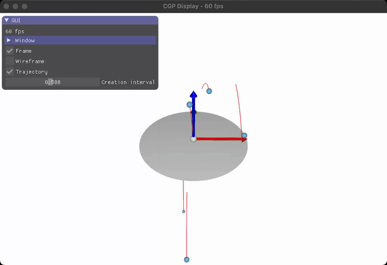

# Procedural Animation - Bouncing Sphere

This code model procedurally the trajectory of a set of spheres falling under gravity.

- Make sure you can compile and execute the code.\
  Note: This is another source code, the procedure to run CMake and parameterization of your IDE has to be redone.

The directory particles contains the structure associated to the particle model (position, velocity, time of birth, etc.). The general calls for the creation and display of the particles is defined in the file `scene.cpp`, in the function `display_frame()`.

- Try to find the initial velocity of the particles ?\
  Note: `rand_uniform(a,b)` is a function generating a uniform random float value in the interval \[a,b\].
- Change the initial speed such that particles have a varying vertical component in their initial speed.

Note how the particles are removed with the function `remove_old_particles`

- You can change the delay between the emission of a new particle (variable `timer.event_period`) in the function `scene_structure::initialize()`. This is also a parameter which we can control through GUI.

## **TODO**: Collision response with one bounce

So far, each sphere follows a pure parabola trajectory without taking into account its collision with the plane.

- Implement such collision response in the system as an explicit parametric function.
        You only need to implement one bounce, not an arbitrary number of them.

- Tips:
    - You should modify the code of the function `particle_structure::evaluate_position()`
    - Limit the computation to one bounce
        - Compute first the time at which a particle intersects the ground.
        - Then set the new expression of the trajectory after the bouncing taking into account a small decrease of energy.

[Interactive View](https://imagecomputing.net/course/2023_2024/inf585/lab/content/02_procedural_animation/b_sphere_bounce/web/index.html)

## **EXTRA** (**NOT** mandatory):
- In the previous example, the collision is explicitly displayed by some shadow-looking effect.
  - How could you model such effect ?
  - Try to implement it if you have time - otherwise move to another exercise (**AGAIN, THIS PART IT IS NOT MANDATORY**).

General remarks:

- In this case, you have implemented in a "procedural way" the trajectory as a "parametric function" = a trajectory which is fully defined from the input value tt. Such parametric approach has pros and cons:
  + **(+)** The trajectory is "exact"\
    The particle follows the expected parabola without suffering from error accumulation along time.
  + **(+)** Efficient computation at "random" time.\
    You can evaluate the position of the particle at an arbitrary time value (without requiring the position at a previous time).
  + **(-)** Limited type of trajectory complexity.\
    Only one bounce is modeled, extension to an arbitrary number is possible but more complex.
    Handling bouncing between colliding spheres would be even more complex.

To handle more complex trajectories (i.e. spheres colliding together), another approach would be to consider numerical time integration along a physical simulation. In such case, we would integrate the sphere's position at each time step based on the previous position, and then check if a collision occurs. This approach could lead to more complex effects on the particles trajectories, but would also lose the advantage of the parametric approach.
