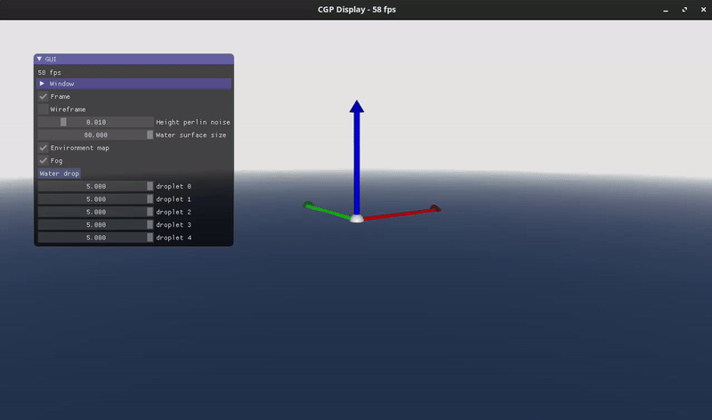

# Procedural Animation - Water Droplet

This code displays a scene with a procedurally animated regular grid that models a water surface.

- The animation of the surface is computed directly in the vertex shader `shaders/water/water.vert.glsl`
- The fragment shader `shaders/water/water.frag.glsl` also implements an environment map which is already pre-coded.
- When you press on the `SPACE` key or click on the GUI button water drop, a geometric deformation is applied to a random location on the grid. This deformation is implemented in the vertex shader.

## **TODO**: Water droplets with ripples

Objective: The objective is to modify the shader deformation to represent a dynamic effect of a water droplet inspired by the example below.

- The modification should be made in the function `float deformation(float x, float y, float t)` in the file `shaders/water/water.vert.glsl`.
- The code is set to allow up to five active droplet effects at the same time. A counter starts for each new droplet effect and lasts for five seconds (see the function `scene_structure::new_water_droplet`).
- Each droplet effect is fully parameterized by a single `vec4` structure storing respectively its x coordinate, y coordinates, initial time of the droplet effect, and an additional parameter indicating if the droplet effect has already be created or not.
- Help: The droplet effect can be parameterized as a mix of expanding Gaussian bump multiplied by a cosine function.
- Once the droplet effect is implemented, you may add an additional view of a falling droplet above the water displayed as a sphere that falls down before starting the deformation effect on the water surface.

[Interactive View](https://imagecomputing.net/course/2023_2024/inf585/lab/content/02_procedural_animation/e_water_droplet/web/index.html)