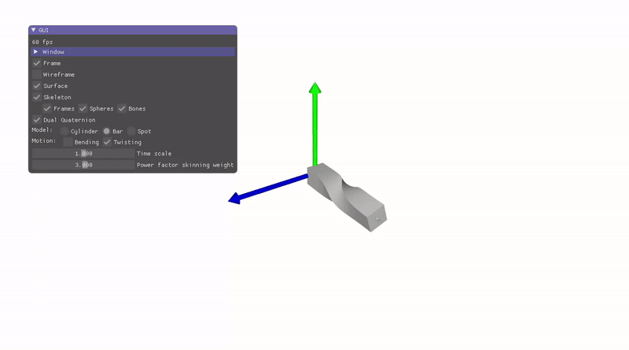

# Skinning Deformation

> Path of the scene 05_skinning/a_skinning

The objective of this scene is to model skeleton-based character deformation using linear blend skinning and dual quaternion skinning, as well as an automatic computation of skinning weights. 

Once completed, your result should be similar to this [online version](https://imagecomputing.net/course/2023_2024/inf585/lab/content/06_skinning/web/index.html)

In the current initial state of the program three models are proposed:
- A cylinder surface, associated to a skeleton with two bones (3 joints) that can bend, and/or twist (can be controled by the GUI interface).
- A cow model, associated to a more generic skeleton. The skeleton is described from file inputs available in `assets/spot/`.
- The motion of the skeleton is hard coded in the program. In file `scene.cpp`, function `animate_skeleton`.
- Procedural skinning weights are already provided for the case of the cylinder and bar. In `scene.cpp`, function `compute_skinning_weights_cylinder()`.

    $w_0=\frac{1}{2}\vert x/2 \vert, w_1 = 1 - w_0, w_2 = 0 \text{ for vertices with } x<0.5$

    $w_0=\frac{1}{2}\vert 1 - \frac{x - 1/2}{2}\vert, w_1 = 1 - w_0, w_2=0 \text{ for vertices with } x \geq 0.5$

- The value of the exponent $\alpha$ can be interactively modified in the GUI interface.
- This function only works in the case of a 3-joint skeleton with a tubular mesh oriented along the x-coordinate, and $x\in[0,1]$.
- The model of cow doesn't have skinning weights computed and remains static.

## Linear Blend Skinning

The first objective is to complete the linear blend skinning deformation to make it work on the cylinder and bar model. The function to be completed is in the file animated_model.cpp, function skinning_lbs().
We remind the Linear Blend Skinning formulation: 

$p_i=\sum_j w_{ij} T_j p_i^0$​

where

- $i$ is the current vertex index, and $j$ varies over the skeleton's joints.
- $p_i$​ is the newly deformed position of vertex i.
- $p_i^0$​ is the initial position of vertex i in the so called "bind pose".
- $w_{ij}$​ is the skinning weights relating the vertex $i$ and joint $j$.
- $T_j$​ is the $4\times 4$ transformation matrix corresponding to the rigid transform on joint j from its bind pose to its current one.
  This transformation matrix can be express itself with respect to the joint frame matrices in the current pose $M_j$​ and bind pose $M_j^0$​, where $M_j$​ represent the orientation and position of the joint in the global reference space:
  $T_j = M_j (M_j^0)^{−1}$

  Note: The difference between $T_j$​ and $M_j$ is that:
    - $M_j$​ represents an absolute orientation and position of the joint frame in space.
    - $T_j$​ represents a transformation between the bind pose to the current skeleton state.

Once implemented, you should obtain a valid bending-like deformation for the cylinder and the bar.
Note: It is normal that the cow is not yet deforming as it lacks skinning weights, and the twisting motion on the cylinder and bar would lead to collapsing artifact.

## Generating skinning weights

The cow model only contains a mesh and an animated skeleton, but lacks skinning weights. The goal in this part is to adapt the function `compute_skinning_weights_generic()` in the file `scene.cpp` in order to generate skinning weights automatically. A possibility is to compute the skinning weights as 

$w_{ij}=\kappa(d_{ij})/\sum_j \kappa(d_{ij})$

where

- $d_{ij}$​ is the closest cartesian distance between the position of vertex i and the bone segments starting at joint j.
- $\kappa$ is a kernel function that gives higher skinning weights to small distance values than large ones. For instance $\kappa(x)=1/x^{\alpha}$.

Once computed, the cow model should now be animated along its skeletal animation.

> [!IMPORTANT]
> It is normal that the automatic computation of skinning weights doesn't provide a perfect result. To achieve better results, more advanced distance computation (e.g. taking into account interior/exterior of the shape could be considered). Ultimately, modeling software like Blender or Maya allows to manually paint weights for fine tuning.

## Dual Quaternion Skinning

The use of Linear Blend Skinning on the twist motion of the cylinder and bar leads to collapsing artifact due to the linear blending of the transformation matrix components. A solution to this problem is the use of the *Dual Quaternion Skinning* - DQS.

Implement the dual quaternion skinning deformation in the function `skinning_dqs()` from file `animated_model.cpp`. Once implemented, the twist motion on the bar should look like the following.

**Hints:**
- There is no dual quaternion class already coded, it is up to you to add the necessary structures and functions.
- Think first on how you can model a dual number with code.
    - The number $\varepsilon$ doesn't "exists" explicitely in code, but you can model a structure implementing the algebraic properties applied on the "real" and "dual" part of a dual quaternion (it follows the same spirit than implementing a "complex number" or "quaterion" structure for instance).
    - You don't have to implement all the properties of dual numbers as only a subset is needed to implement dual-quaternion skinning (especially dealing with its dual part).

**Reminder/Summary on dual numbers:**

1) Standard operations between two dual numbers $\hat{a} = a + \varepsilon a'$:

$\hat{a} + \hat{b} = (a + \varepsilon a') + (b + \varepsilon b') = a + b + \varepsilon (a' + b')$

$\hat{a} - \hat{b} = (a + \varepsilon a') - (b + \varepsilon b') = a - b + \varepsilon (a' - b')$

$\hat{a} \times \hat{b} = (a + \varepsilon a')(b + \varepsilon b') = ab + \varepsilon (a'b + ab')$

$\hat{a}/\hat{b} = \frac{a + \varepsilon a'}{b + \varepsilon b'} = \frac{a}{b} + \varepsilon \frac{a'b - a'b}{b^2}$

2) Convert unit quaternion $(q_0)$ with translation $(t)$ to  a unit dual quaternion $(\hat{q})$:

$\hat{q} = q_0 + \varepsilon q_t q_0 / 2$

with $q_t = (t_x, t_y, t_z, 0)$ the associated quaternion to the translation coordinates

3) Convert a unit dual quaternion $(\hat{q} = q_0  + \varepsilon q_{\varepsilon})$ into a quaternion $q$ and traslation $t$:

$q = q_0$

$t = (q_t.x, q_t.y, q_t.z)$ with $q_t = 2q_{\varepsilon}q_0^{\star}$, $q_0^{\star}$ conjugate of $q_0$

4) Normalize a non unit dual quaternion $\hat{Q} = Q_0 + \varepsilon Q_{\varepsilon}$ into a unit dual quaternion $\hat{q} = q_0 + \varepsilon q_{\varepsilon}$:

$\hat{q}=\hat{Q}/\parallel Q_0\parallel = Q_0/\parallel Q_0 \parallel + \varepsilon Q_{\varepsilon}/\parallel Q_0 \parallel$