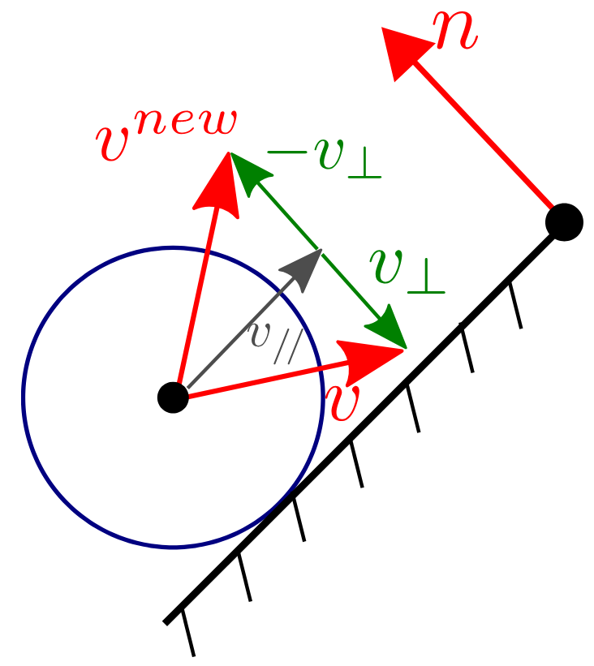
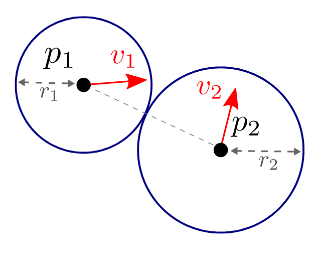

# Simulation - Spheres in Collision

This scene models a set of particles representing spheres falling under gravity. Each particle is associated to the following parameters: position $p$, speed $v$, forces $f$, as well as radius and color.
The position and speed of each particle is updated through time using a discrete integration in the file `simulation/simulation.cpp`

- Velocity update: $v_{k+1}=v_{k}+\Delta f_k$
- Position update: $p_{k+1} = p_k + \Delta t v_{k+1}$

In the current state of the program, only the gravity is taken into account. But the collision with the cube boundaries and between the sphere need to be implemented. Add the collision detection and response between the spheres and boundary faces of the cube using impulse based response on the sphere velocities.
The collision response can be implemented in two steps:

- **First** applying impulse response to generate the bouncing (with the cube, and other particles)
- **Second** canceling the velocity components that still generate a penetration (with the cube, and other particles)

## ${\color{cyan}\bf{TODO}}$: Collision Sphere-Plane: 

 

- You must compute the detection of the collision sphere-plane which can be described as:
        $(p_i - a)\cdot n > r_i$
where $p_i$ is the position of the particle, $a$ is the position of the surface, $n$ the normal to the surface and $r_i$ the radius of the particle.
- If a collision is detected then a response must happen only if there is no negative oriented velocity:
        $(p_i - a)\cdot n - r < 0 \text{ and } v_i\cdot n < 0$
- For the response you must decomposed the velocity in two components with respect to the normal surface (parallel and perpendicular):
    
    $v_{\bot} = (v \cdot n) n$

    $v_{\parallel} = v - (v \cdot n) n$
    
- Finally you compute the new velocity:
        $v^{new} = \alpha v_{\parallel} - \beta v_{\bot}$
        With $\alpha,\beta \in [0,1]$ being the restitution coefficient in each direction with $\parallel$ being the friction and $\bot$ the impact (you can choose your own values for $\alpha$ and $\beta$).

## ${\color{cyan}\bf{TODO}}$: Collision Sphere-Sphere:

- Again, start by detecting the collision between two particles:
$\parallel p_1 - p_2 \parallel \leq r_1 + r_2$
- If a collision is detected, you must compute the impulse $j$ but first check that there is no negative orientation $v_{12}\cdot p_{12} < 0$ (if opposite, no update happen). For this step we assume an ellastic collision (No loss of energy/Conservation of kinetic energy of the system).
    - The impulse is computed as follows:

        $j = 2\frac{m_1 m_2}{m_1 + m_2}(v_2 - v_1)\cdot u$

        $\text{where }u = (p_1 - p_2)/\parallel p_1 - p_2\parallel$

- To simplify, we assume that for all particles $m=1.0$.
    - Use the impulse to update the velocities with $\alpha$ as damping coefficient:

        $v_1^{new} = \alpha(v_1 + ju)$

        $v_2^{new} = \alpha(v_2 - ju)$  

## ${\color{cyan}\bf{TODO}}$: Collision Correction

- Collision sphere-sphere:
    - If a collision is detected, check if there is penetration between particles.
        
        $(v_1 - v_2)\cdot u < 0$

        $\text{where }u = (p_1 - p_2)/\parallel p_1 - p_2 \parallel$
        
    - If the condition is meet, cancel the velocity components that still produce penetration between particles.
- Collision sphere-plane:
    - If a collision is detected, check if there is penetration between the plane and the particle.
    $(p_i - a)\cdot n - r< 0$
    - If the condition is meet, cancel the velocity component that produces the penetration between plane and particle.

Once the velocity is computed, then the sphere positions are finally updated

> [!NOTE]
> You may perform several iterations of the numerical integration at each frame in order to speed up the simulation, while keeping a constant (or smaller) time step.

## ${\color{cyan}\bf{SUBMISSION}}$

Compress the "src" folder to "src.zip" file and submit it.
