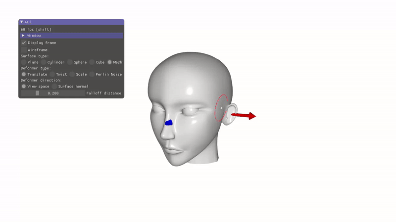
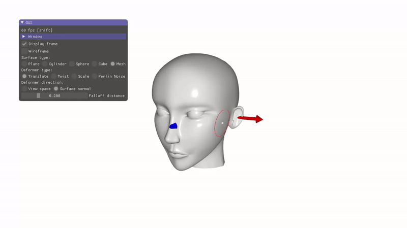
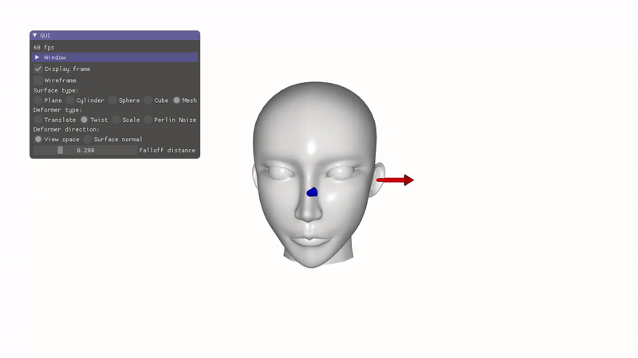
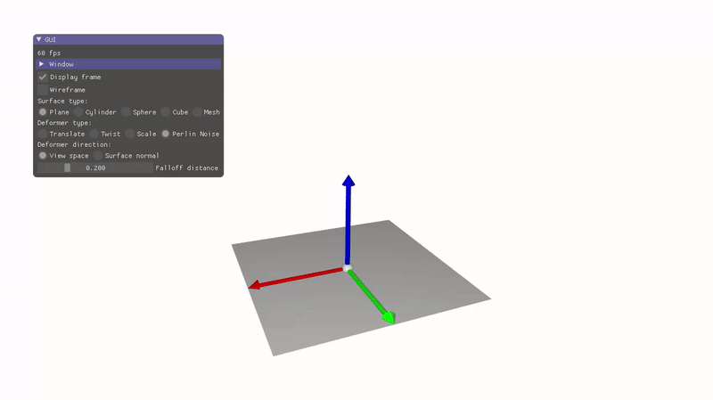

# Interactive Deformers

> Path of the scene is 06_deformers/a_interactive_deformers

The objective of this scene is to model interactive deformers allowing to locally grap and pull/push, scale, and bend/twist some part of the surface. 

## Current state of the code

In the current state of the program a vertex $p_0$​ of the surface can be selected while pressing the key *SHIFT* and moving the mouse.

A left click on the mouse followed by a drag-and-drop allow to select a sub-part of the surface around $p_0$​, and translate it along the mouse displacement. The size of this sub-part is parameterized by a falloff distance visualized as the red circle around the selected vertex. This distance can be interactively modified using the scroll of the mouse, or directly using the corresponding slider in the GUI.

Different surfaces can be loaded in selecting in the GUI: *plane, cylinder, sphere, cube*, or a *pre-defined mesh*.
The type and direction of deformer do not have any effect yet. 

The deformation of the surface is computed in the function `apply_deformation` located in the file `deformers.cpp`. This function is called every time a vertex is selected and the mouse is dragged. 

So far, the current deformation implements a translation in the view space with a local linear profile. 

- If ($\parallel p - p_0\parallel < d_{falloff}$):

    $p = p_0 + (\parallel p - p_0 \parallel / d_{falloff}) \times translation$

    With:
    - $d_{falloff}$: fall off distance
    - $p$: the coordinates of the vertex to deform
    - $p_0$: the initial position of the selected vertex (before deformation)
    - translation: the 3D translation implied from the mouse displacement in the camera plane

### Translation in the camera plane

Change the function `apply_deformation` in the file `deformers.cpp` to model the following effect where the surface can be smoothly pulled/pushed along the mouse displacement.

### Translation in the surface normal direction

In the same file add the possibility to constraint the translation to act only along the initial normal direction of the picked vertex (note that this information is stored in the `deformer_parameters_structure` structure). 

*Let the user interactively select the deformation he wishes to apply using the checkbox Deformer direction: View space/Surface normal*

### Twist

Add the possibility to twist the surface: the direction of the twist being defined either by the camera direction, or the normal of the surface, and its angular magnitude is given by the amount of mouse displacement.

### Scale

Finally, add the possibility to expand/squeeze the surface around the selected vertex. In this case, there is no choice of View space/Surface normal direction.

### Extra - Noise Magnitude

**IF YOU HAVE TIME (yes, only if you have)**, add the possibility to add locally Perlin noise deformation whose magnitude is controled by the amount of translation of the mouse

