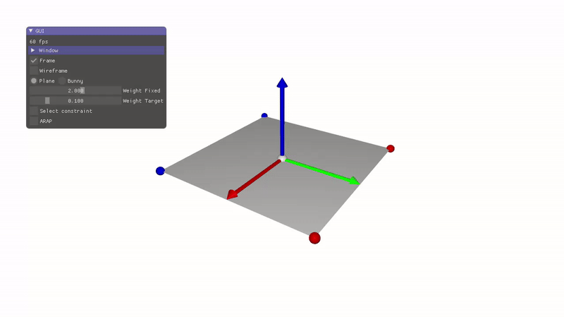
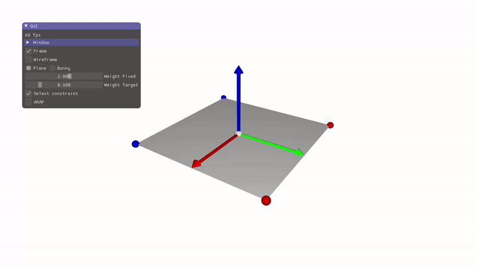
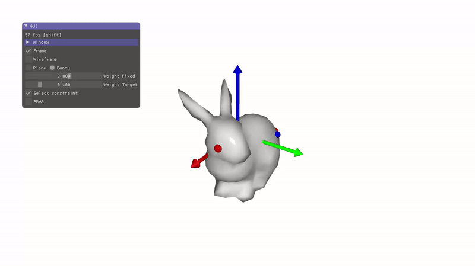
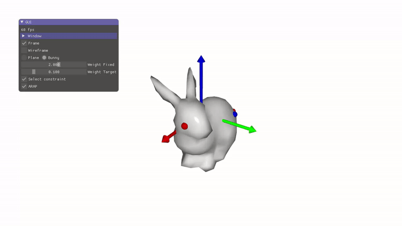

# Laplacian editing, ARAP

> Path of the scene is 06_deformers/b_laplacian_deformation

The objective of this scene is to model interactive laplacian deformation similarily to the following two articles:
- [[1](https://igl.ethz.ch/projects/Laplacian-mesh-processing/Laplacian-mesh-editing/diffcoords-editing.pdf)] Differential Coordinates for Interactive Mesh Editing. O. Sorkine et al. SMI 2004
- [[2](https://igl.ethz.ch/projects/ARAP/arap_web.pdf)] As-Rigid-As-Possible (ARAP).

## Current state of the code

In the current state of the program a planar grid surface is displayed. And an interactive vertex selection system is proposed (with no effect on the surface so far).



The blue vertices are supposed model static vertex position that should be preserved during deformation.
- The four corners are initially set as static constraints.
- These vertices are stored in the structure `constraints.fixed`.

The red vertices are supposed to model target vertices that the user can moves.
- The vertex in the middle of the grid is initially selected as target.
- These vertices are stored in the structure `constraints.target`.

To translate the target vertices, press shift key and drag and drop the mouse. A white sphere indicates where the target vertex has been translated. 

Another mode "Select constraint" is proposed where these constraints can be modified.
- In this mode, new target constraints are selected using a rectangular selection box activated using shift key + mouse drag and drop over some part of the surface.
- A drag and drop with the left button of the mouse selects new target constraints, while the right button of the mouse selects new fixed constraints.
- Selecting an empty space allows to erase existing constraints.

## Laplacian surface deformation

The deformation of the surface can be expressed as the set of position $q_i$ minimizing the following energy.

$E = \sum_{i=0}^{N-1} \parallel \delta(q_i) - \delta(p_i) \parallel^2 + \sum_{i \in C} \omega_i \parallel q_i - c_i \parallel^2$

$E = \sum_{i=0}^{N-1} \parallel q_i - \frac{1}{\mathcal{N}_i} \sum_{j \in \mathcal{N}_i} - \delta(p_i) \parallel^2 + \sum_{i \in C} \omega_i \parallel q_i - c_i \parallel^2$

- $N$: number of vertices
- $p_i$: Initial vertices position
- $\mathcal{N}_i$: 1-ring of vertex i. $|\mathcal{N}_i|$ the size of the 1-ring.
- $\delta(p_i) = p_i - \frac{1}{|\mathcal{N}_i|} \sum_{j \in \mathcal{N}_i} p_j$
- $C$: Set of constrained vertex
- $c_i$: Position of the constrained vertex
- $\omega_i$: Weight associated to the constrained vertex $i \in C$

This energy can be reformulated in a matrix form with unknown $q = (q_0, \cdots ,q_{N-1})$

$E = \parallel Mq - b \parallel^2$

Note that $M$ is a large sparse matrix of size $(N + N_c) \times N$ where $N_c$ is the number of constraints.

Your goal is to **build the matrix and vector** associated to this energy, and **solve the linear system** in order to compute the new surface.

**__Solving linear systems using Eugen__**

[Eigen](http://eigen.tuxfamily.org/index.php?title=Main_Page) is C++ library for efficient matrix manipulation and linear system solver. You can use it to encode your matrix and vector associated to the least square problem. This library (composed only of header files) is already included with the code library (in third_party/eigen).

Note that you can use dense matrix solver, but to fully take advantage of the sparse structure of the matrix, you can directly use the Sparse matrix and solver proposed by Eigen. 

If you are not familiar with Eigen, the following code shows a basic example of sparse system solver for least square problem (note that several solvers are proposed in Eigen, and you may experiment with them) 

```c++
#include <iostream>
#include <Eigen/Sparse>

int main()
{
    // Build matrix
    Eigen::SparseMatrix<float> M;
    
    
    int N = 50;
    M.resize(N,N);
    // Note: A sparse matrix doesn't store explicitly 0-value entries

    // Reserve space to store non-zero coefficients
    //   ex. N rows, 10 non-zero coeffs per rows (only a guess for efficiency purpose)
    M.reserve(Eigen::VectorXi::Constant(N,10));

    // Fill the matrix ... M.coeffRef(i,j) = value
    for(int k=0; k<N; ++k) {
        M.coeffRef(k,k)=1.0f; M.coeffRef(k,(k+1)%N)=-0.3f;
    }
    
    // Compress the matrix representation
    M.makeCompressed();

    // Factorization for a solver (here Conj. Gradient)
    Eigen::LeastSquaresConjugateGradient< Eigen::SparseMatrix<float> > solver;
    solver.compute(M);
    solver.setTolerance(1e-6f);

    // Build RHS
    Eigen::VectorXf b;
    b = Eigen::VectorXf::Random(N);

    // Solve linear system
    Eigen::VectorXf x = solver.solve(b);
    // or solver.solveWithGuess(b, x0) 
    //   faster with good guess

    std::cout <<"Check solution : "
       << (M*x-b).norm() << std::endl;   
    std::cout <<"N iterations : "
       << solver.iterations() << std::endl;   

    return 0;
}
```

**__Solving for Laplacian deformation__**

1. Build the associate matrix $M$ and right-hand-side $b$ depending on your shape and constraints.
2. Then solve the least square problem and display the result.
- In a first step, you can build the matrix and solve it as an initial step. You can consider only one type of constraints. 
- Then in a second step, you may dispatch the adequate part of your code in the two following functions in order to handle interactive deformations:

    `build_matrix` : fill the matrix coefficient and perform factorization
    
    `update_deformation` : solve the system for the given constraints

        + handle the two types of constraints: fixed positions, and target one.
> [!NOTE]
> You will need to compute the one ring of your surface 
> Check the specific structure of your matrix with a coarse mesh (you can print it on the command line). 
> If you don't translate your constraints, the solution should be the initial planar grid surface 
> You can solve three systems in x, y, and z coordinates using the same matrix, but different rhs.
> Using a guess solution with the "LeastSquaresConjugateGradient" helps to speed up the solution.

 

## As-Rigid-As-Possible

The As-Rigid-As-Possible method adds to the previous energy formulation the use of a matrix $R(q_i)$: rotation corresponding to the optimal rigid transform between $p_i$​ (and its neighborhood) and $q_i$​ (and its neighborhood).

$E = \sum_{i=0}^{N-1} \parallel q_i - \frac{1}{\mathcal{N}_i} \sum_{j \in \mathcal{N}_i} q_j - R(q_i)\delta(p_i) \parallel^2 + \sum_{i \in C} \omega_i \parallel q_i - c_i \parallel^2$

The energy is solved using an iterative process interleaving between two steps.
- For fixed $R(q_i​)$, the optimal $q_i$​ can be found using the previous least square approach in minimizing $∥Mq−b_R∥^2$, where $b_R$​ is the right-hand-side taking into account $R(q_i)$.
- For fixed $q_i$​, the optimal rotation matrix $R(q_i​)$can be found using the polar decomposition of the covariance matrix $\sigma = \sum_j e_j(e_j^0)^T$, where $e_j$​ (resp. $e_j^0$​) are the edges of the 1-ring of $q_i$​ (resp. $p_i$). 

**Implement the ARAP deformation** and observe that the rotation of the surface automatically adapts to the constraints.
- You may use a few iterations per step(<5).
- Eigen can compute the SVD of matrices to compute robustly a polar decomposition.

 