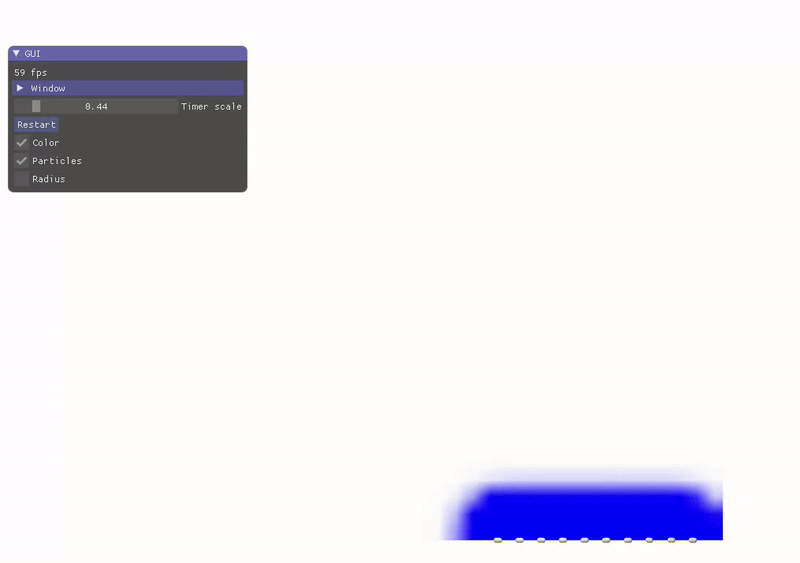

# Simulation - Smoothed Particle Hydrodynamics

> Path of the scene 08_sph/

The objective is to model a fluid simulation using SPH model. So far, only the gravity force is applied on the particles.

The blue color around the particle comes from a field function set as $f(p)=\sum_i exp(-(\parallel p - p_i \parallel / \sigma)^2)$ and displayed as a colored texture to give the visual impresion of continuous fluid material.

<ins>Initial state of the program</ins>

## Density

*Fill the function `update_density`* that set the density at each particle position $\rho_i$ using a smooth kernel.

$W_h(p) = \frac{315}{64\pi h^3} (1 - (\frac{\parallel p \parallel}{h})^2)^3, \parallel p \parallel \leq h$

Note that this kernel is already implemented in the function `W_density`.

__Complete the function__ `update_force` to add the force component related to the *pressure* and check that the solution seems reasonable (before adding viscosity forces)

Note: Fill the function `W_gradient_pressure` to be the gradient of the spiky kernel and use it in the computation of the pressure force

<ins>Example obtained without viscosity using 20 integration steps for each frame</ins>

## Viscosity

**Add the viscosity component** to the acceleration and observe the behavior for various viscosity (you may need to decrease the integration time step for large viscosity value).

<ins>Adding viscosity</ins>

<ins>Example with more particles</ins>

## Extensions

- Note that particles have been initialized in the $(x,y)$ plane and leads to a 2D simulation. But if you initialize particles in 3D (or add a small $z$ component in their initial position), the simulation will adapt seamlessly to 3D.
- If you have spare time: Implement an acceleration grid structure to avoid comparing all pairs of particles (ex. uniform grid). 